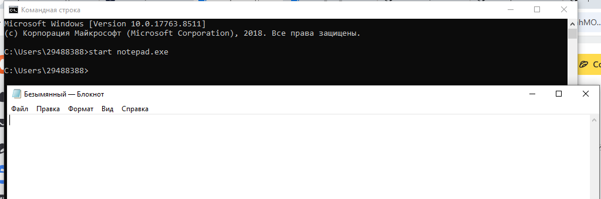
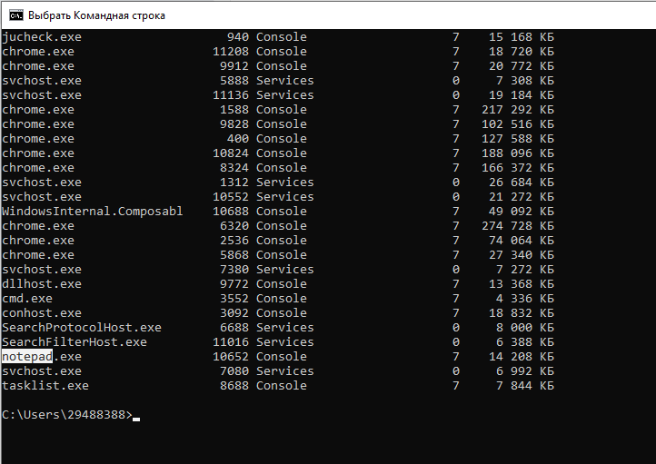
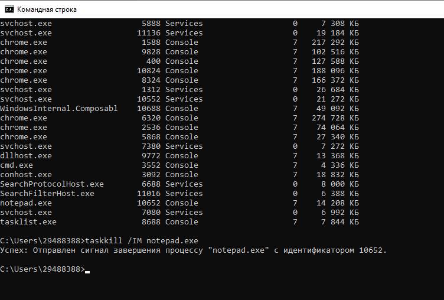
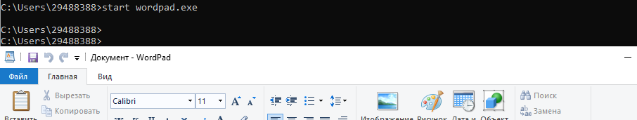
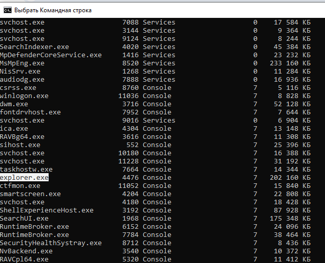
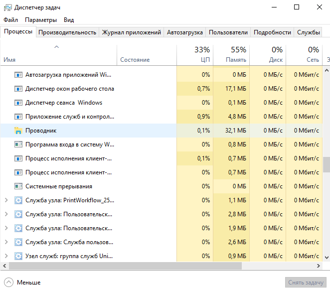
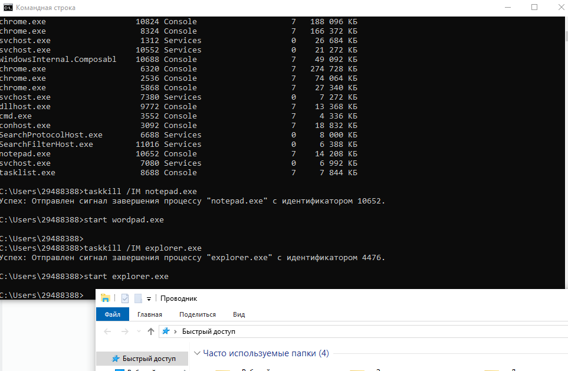
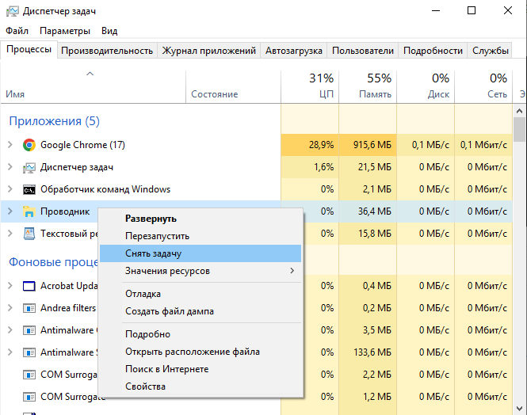

# Лабортаторная работа №2
## Управление памятью и процессами в ОС Windows

## Цель работы: 
Практическое знакомство с управлением вводом/выводом в операционных системных Windows и кэширования операций ввода/вывода

## План проведения занятия
1. Ознакомиться c краткими теоретическими сведениями.
2. Ознакомиться с назначением и оновными функциями Диспетчера задач Windows.
3. Приобрести навыки применения командной строки Windows. Научиться запускать останавливать и проверять работу процессов.
4. Сделать выводы о взаимосвязи запушенных процессов и оперативной памятью компьютера.
5. Подготовить отчет для преподавателя о выполнении лабораторной работы и записать его в папку «Выполнение».

**Задание 2. Запуск блокнота через командную строку**   

*Запустим программу «Блокнот»* 

*Отследим процесс Блокнот*  

*Через команду завершим процесс блокнота*

*Запустим worldpad*  

*Отследите выполнение процесса explorer.exe при помощи диспетчера задач и командной строки.*   

*Завершим процесс explorer.exe через диспечер задачь и командную троку*   

# Контрольные вопросы

1. В чем заключается суть управления вводом/выводом в операционной системе? 

ОС выступает посредником между программами и «железом» (дисками, клавиатурой, принтером). Она скрывает техническую сложность устройств, предоставляет им общие правила работы (через драйверы) и следит, чтобы разные процессы не обращались к одному устройству одновременно, вызывая сбои.

2. Характеристика «Диспетчера задач Windows». Перечислите основные его функции.

Это системная утилита для мониторинга ресурсов компьютера в реальном времени.
Основные функции: завершение зависших программ, контроль нагрузки на ЦП/память/диск, управление автозагрузкой, просмотр активных служб и сетевой активности.

3. Что такое процесс в операционной системе?

Это экземпляр программы, которая выполняется в данный момент. У процесса есть выделенная ему оперативная память, адресное пространство и системные ресурсы. Один файл (например, chrome.exe) может породить сразу несколько процессов.

4. В чем сходство и различие понятий «приложение» и «процесс»? Приведите примеры.

Сходство: Оба представляют собой программный код, выполняемый системой.

Различие: Приложение — это то, что видит пользователь (окно программы), а процесс — это техническая единица работы для ОС.

Пример: Приложение «Браузер» открыто одно, но в Диспетчере задач вы видите 10 процессов (по одному на каждую вкладку и расширение).

5. Что такое служба в операционной системе?

Это специальная программа, которая работает в фоновом режиме без участия пользователя. Она запускается часто еще до входа в систему и не имеет графического интерфейса (окна).

6. В чем различие между «службой» и «процессом»? Приведите примеры.

Различие: Любая служба работает как процесс, но не любой процесс — служба. Службы выполняют системные задачи (обновления, печать, сеть), а обычные процессы инициируются пользователем.

Пример: Процесс notepad.exe (Блокнот) закроется, если вы выйдете из системы. Служба Print Spooler (Очередь печати) продолжит работать, даже если на компьютере никто не залогинен.

7. Перечислите основные команды работы с процессами при помощи командной строки.

tasklist — просмотр списка всех запущенных процессов; taskkill — принудительное завершение процесса (например, taskkill /f /im notepad.exe).
