# Лабораторная работа по процессам в Linux

## Цель работы

Изучение жизненного цикла процессов в операционной системе Linux, освоение практических навыков управления режимами их выполнения, мониторинга системных ресурсов и способов корректного завершения задач.

### Задачи работы:
1. Научиться запускать процессы в активном (`foreground`) и фоновом (`background`) режимах, а также перемещать задачи между ними.
2. Освоить методы сохранения работоспособности программ после закрытия терминала или выхода пользователя из системы (`nohup`, `screen`).
3. Изучить инструменты статического и динамического мониторинга процессов (`ps`, `pstree`, `top`), а также методы их поиска в системе (`pgrep`).
4. Научиться анализировать общую утилизацию аппаратных ресурсов компьютера: оперативную память (`free`) и среднюю нагрузку на процессор (`uptime`).
5. Освоить механизмы отправки сигналов завершения процессам с использованием утилит `kill` и `pkill`.

## 1. Запуск задач в активном и фоновом режиме (Foreground и Background)

* **Foreground (активный режим)** — процесс занимает терминал, блокируя ввод.
* **Background (фоновый режим)** — процесс работает параллельно, терминал свободен.

```bash
  man sleep
```
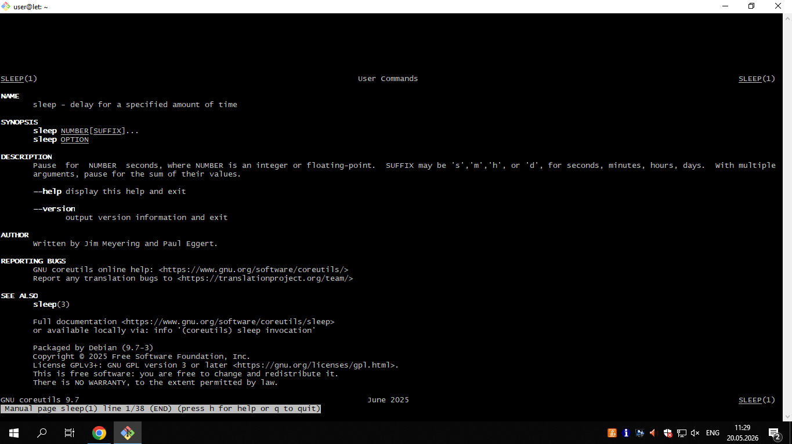

```bash
  sleep 1000
```
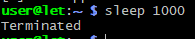

```bash
  jobs
```
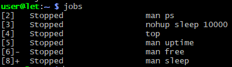

```bash
  bg #
```
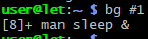

```bash
  man ps
```
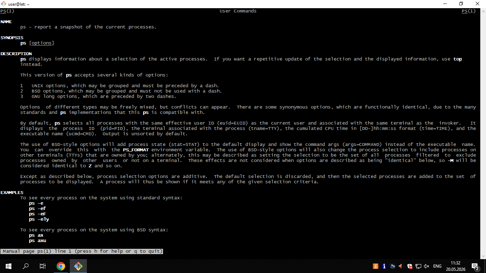

```bash
  ps aux | grep sleep
```
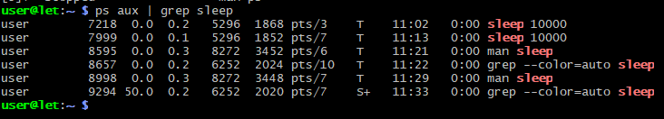

```bash
  nohup sleep 10000
```
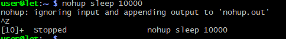

```bash
  pstree
```
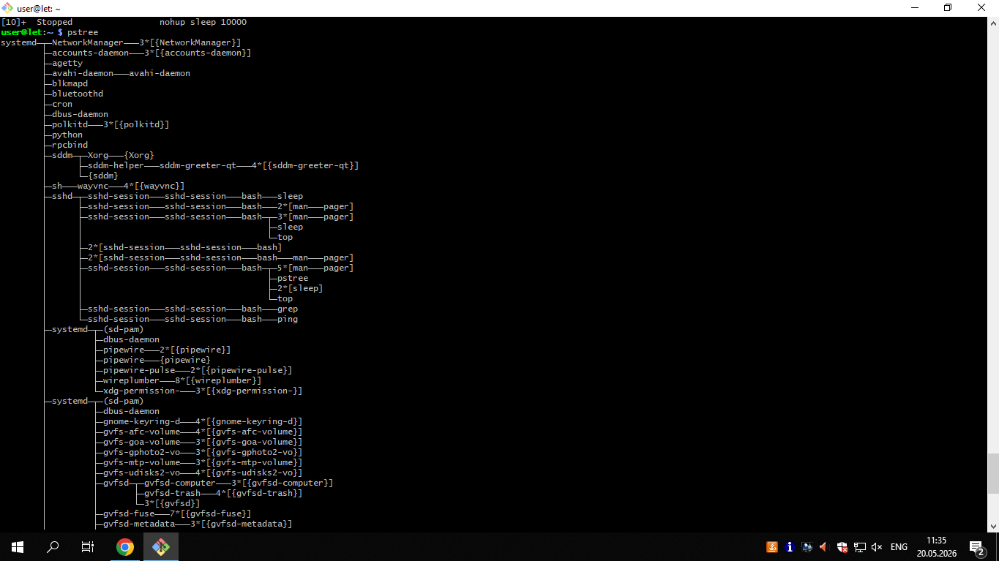

```bash
  top
```
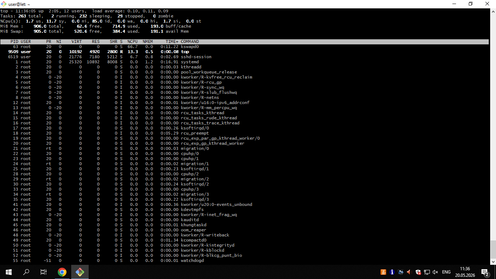

```bash
  man uptime
```
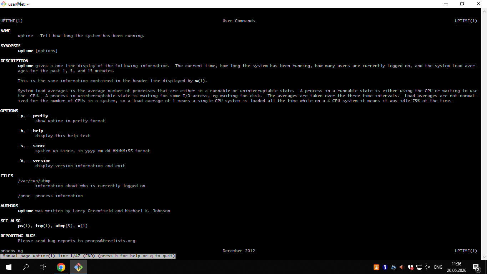

```bash
  man free
```
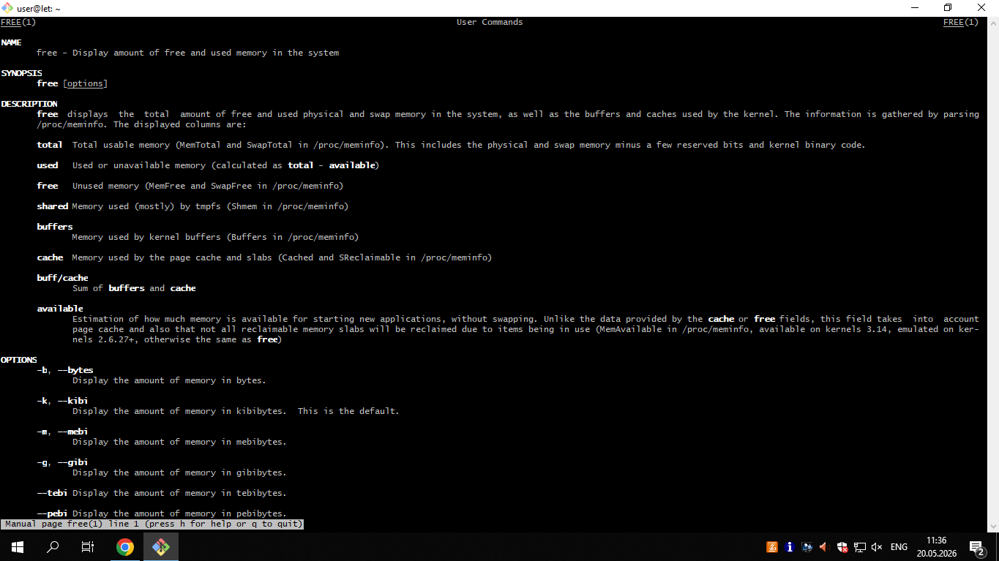

```bash
  swap Linux
```
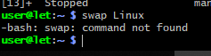

```bash
  man screen
```
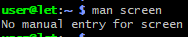

```bash
  ping ya.ru
```
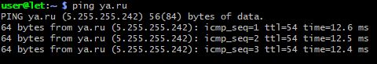

```bash
  Screen -S yandex ping ya.ru, screen -S rambler ping r0.ru
```
```bash
  screen - ls
```
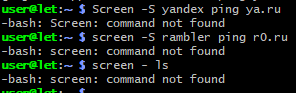

## Вывод

В ходе выполнения лабораторной работы были освоены практические навыки управления процессами и мониторинга системных ресурсов в операционной системе Linux (на примере дистрибутива Debian). 

### Основные результаты работы:
1. **Управление режимами выполнения**: Освоены механизмы перевода задач между активным (`foreground`) и фоновым (`background`) режимами с помощью утилит `bg`, `fg`, а также диспетчеризация фонового пространства через команду `jobs`.
2. **Обеспечение отказоустойчивости сессий**: Изучены способы защиты процессов от сигнала закрытия терминала `SIGHUP` с помощью утилиты `nohup` и полноценного менеджера терминалов `screen`, что критически важно для выполнения длительных фоновых задач на серверах.
3. **Мониторинг и инспекция системы**: Применены инструменты статического (`ps`, `pstree`, `pgrep`) и динамического (`top`) анализа запущенных процессов. Освоены методы оценки загрузки оперативной памяти (`free`) и общего состояния сервера (`uptime`).
4. **Контроль и завершение процессов**: Получены практические навыки отправки системных сигналов завершения (включая `SIGTERM` и `SIGKILL`) с использованием утилит `kill` (по PID или Job ID через синтаксис `%`) и `pkill` (по имени процесса).

### Заключение:
Приобретенные навыки администрирования процессов являются базовым фундаментом для управления серверными операционными системами, оптимизации распределения вычислительных ресурсов и автоматизации фоновых задач в среде Linux.