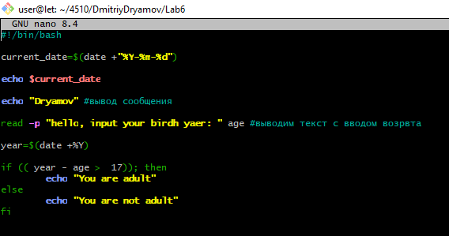
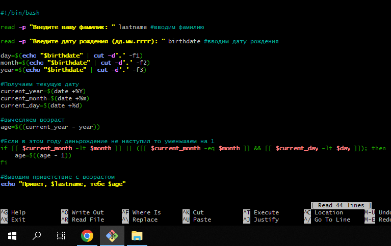

# Лабораторная работа по написанию простого скрипта на BASH
# Задание 1

1. подключитесь к Rasberry PI по протоколу SSH
2. Зайдите в каталог Вашей группы/фамилии
3. создайте файл скрипта с расширением .sh
4. напишите и запустите скрипт со следующим функционалом:
- вывести текущую время и дату
- вывести сообщение с Вашей фамилией
- ввести год рождения и вывести сообщение, являетесь ли Вы совершеннолетним

# Решение:



# Задание 2

## напишите комментарии к каждой строке

```bash
#!/bin/bash

#
read -p "Введите вашу фамилию: " lastname

#
read -p "Введите дату рождения (дд.мм.гггг): " birthdate

#
day=$(echo "$birthdate" | cut -d'.' -f1)
month=$(echo "$birthdate" | cut -d'.' -f2)
year=$(echo "$birthdate" | cut -d'.' -f3)

#
current_year=$(date +%Y)
current_month=$(date +%m)
current_day=$(date +%d)

#
age=$((current_year - year))

#
if [[ $current_month -lt $month ]] || ([[ $current_month -eq $month ]] && [[ $current_day -lt $day ]]); then
    age=$((age - 1))
fi

#
echo "Привет, $lastname, тебе $age"
```

# Решение:



