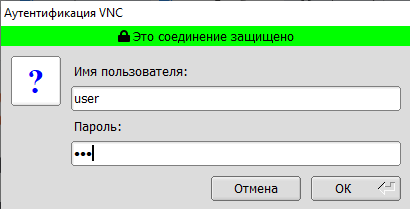
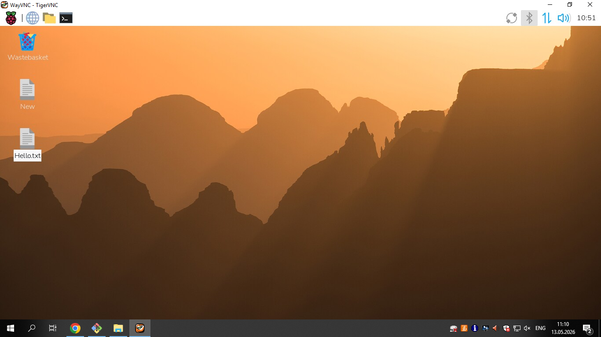
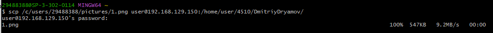
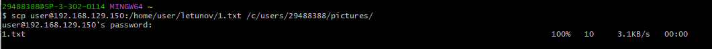

# Лабораторная работа подключение к Raspberry PI по протоколу VNC

Для подключения к Raspberry Pi вам понадобится следующее:

-ваш Raspberry Pi и устройство с клиентом VNC, подключенные к одной сети (например, домашней беспроводной сети или VPN)

-имя хоста или IP-адрес вашего Raspberry Pi

-действительное имя пользователя и пароль для учетной записи на вашем Raspberry Pi

-cкачайте TigerVNC. Вы можете установить последнюю версию с страницы релизов в репозитории GitHub. Нажмите на ссылку в последнем релизе и найдите бинарный файл exe; пользователям Linux следует установить jar.

## Вход через TigerVNS:

## Окно входа:

## Загрузка скриншота по ssh

## Скачивание скриншота по ssh

